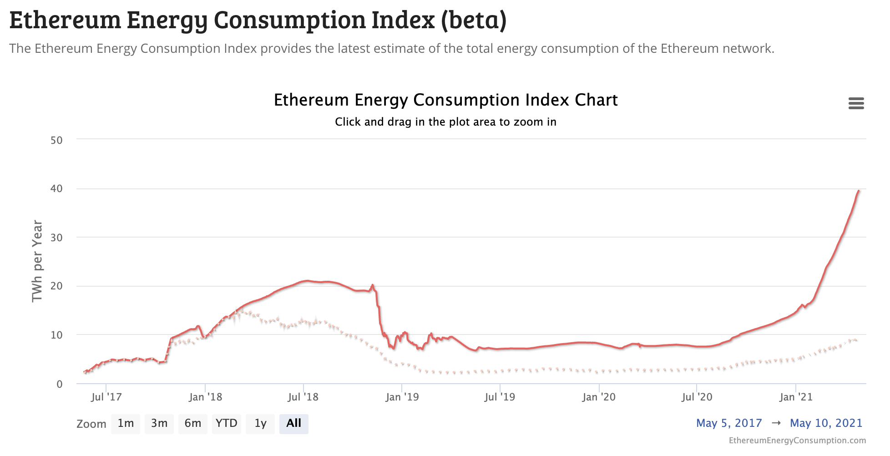
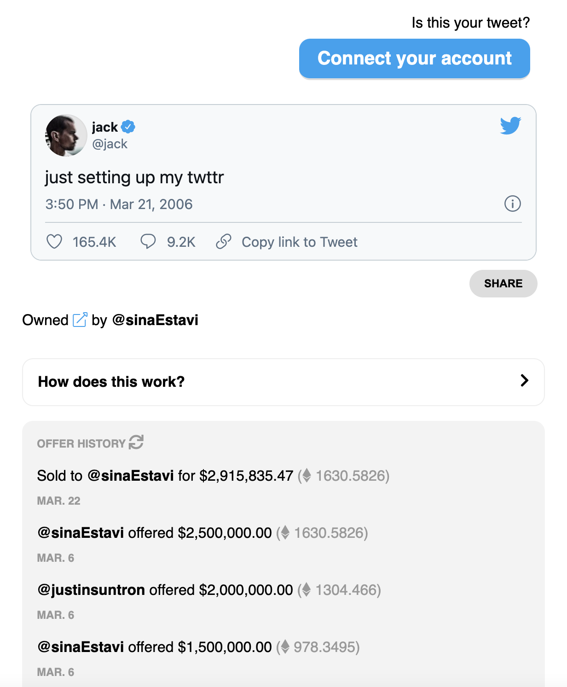

class: inverse, center, middle

# What is Generative Art?

---
class: inverse, center
# Origins

First known ***computergrafik*** (or computer art) comes from the 1968 thesis of George Nees.

.small[
<blockquote>
"Looking at the multi-patterned constructions in Nees' graphics, with their floating ellipsoids, crystalloid spheres and bizarre forms, one cannot help but acknowledge and appreciate their atmospheric and inspiration-inducing effects." - Eva Karcher
</blockquote>
]

George Nees's [8-Ecke](https://knowuh.github.io/IDV2/odonnel-p/ps-02/d.html) (1968) ("Eight Corner")

<div style="width:225px; height:225px; margin:0 auto;">

---
class: inverse, center
background-image: url(https://www.deanspot.org/assets/eightcorner/nees-8-corner-20f6bdbc.jpg)
background-size: contain
---
class: inverse

# Human Rules, "Machine" Run

Generative art is art that in whole or in part has been created with the use of an **autonomous system**.

```{r echo=FALSE, eval=TRUE, message=FALSE, results='hide', warning=FALSE, fig.keep='all', fig.align='center', fig.width=5, fig.height=5}
library(tidyverse)
library(mathart)
result <- kdtree(sample(mathart::points %>% head(1000)))

ggplot() +
    geom_segment(aes(x, y, xend = xend, yend = yend),colour='white',data =  result) +
    coord_equal() +
    xlim(0, 5000) + ylim(0, 5000) +
    theme_void() + theme(panel.background = element_rect(fill = '#272822',colour='#272822'))
# https://paulvanderlaken.com/2018/11/14/mathematical-art/

```

Example: k-d tree using R package *mathart*

---
class: inverse, center

# DeepDream

Popular convolutional neural network (CNN) that finds and enhances images into dream-like hallucinogenic art.

.center[]

Source: [https://deepdreamgenerator.com/](https://deepdreamgenerator.com/)

---

class: inverse

# Algorithmic art

- Algorithmic art refers to computer-generated art.

--
- Algorithmic art is generative art, but generative art does not have to be algorithmic art.

--
- Algorithmic artists are called **algorists**.

--

```{r echo=FALSE, eval=TRUE, message=FALSE, results='hide', warning=FALSE, fig.keep='all', fig.align='center', fig.width=4.5, fig.height=4.5}
library(tidyverse)
df = mathart::harmonograph(n = 10000)

ggplot(df,aes(x=x,y=y)) + geom_point(size=0.1,colour="white") +
    coord_equal() +
    xlim(-2, 2) + ylim(-2,2) +
  theme_void() + theme(panel.background = element_rect(fill = '#272822',colour='#272822'))
# https://paulvanderlaken.com/2018/11/14/mathematical-art/
```

Example: harmonograph using R package *mathart*
---
class: inverse, center, middle
# Other generative art
---
class:inverse, center

# Robotics

<div style="width:355px; height:440px; margin:0 auto;">


Source: Twitter/@stirman
---
class:inverse, center

# AxiDraw
Price: $475, Model: V3/A3; Python API-enabled

<div style="width:550px; height:640px; margin:0 auto;">


Source: [evilmadscientist.com/](https://evilmadscientist.com/)

---
class:inverse, center, middle

# Other generative art:
# Biological

---
class:inverse

### Agar art with bacteria (ASM)

Winner of 4<sup>th</sup> Annual American Society for Microbiology Agar Art (2020)
.pull-left[

]

.pull-right[
Uses the *Candida* yeast species:
- Green - common in human gut
- Metallic green - used for DNA fingerprinting
- Blue - commonly seen alongside HIV infections
- Pink - used in chocolate production
- Purple - yeast infections
- White - common on human hands
]

---
class:inverse, center

### Agar art with bacteria

<div style="width:290px; height:240px; margin:0 auto;">


Source: [smithsonianmag.com](https://www.smithsonianmag.com/science-nature/painting-with-penicillin-alexander-flemings-germ-art-1761496/)

```{r echo=FALSE, eval=TRUE, message=FALSE, results='hide', warning=FALSE}
# Source: 
```

---
class:inverse
background-image: url(https://thumbs-prod.si-cdn.com/ciAlw3et1br9pgJ5Vmgc3DdMbPw=/fit-in/1072x0/https://public-media.si-cdn.com/filer/microbial-art-2.jpg)
background-size: 50px
background-position: 90% 8%

# Agar art

- Messy scientist and son of a pig farmer.

--
- Enjoyed painting cultures on petri dishes.

--
- Treated syphilis and had a lot of patients that were painters at St. Mary's in London.

--
- Kept his desk messy and left petri dishes everywhere on his lab benches.

--
- One day in September 1928, he returned from a trip to discover a goop growing into a stack of abandoned bacterial cultures and killing them.

--
- That circle of goop was fungus. 
- **Alexander Fleming** had discovered the antibiotic properties of what would become known as ***penicillin***.

--
.center[]

---
class: inverse, center, middle

# Social Media Trends

---
class: inverse

# #genuary2021

Daily code prompts to make generative art in the month of "Genuary"

Examples:
- Jan 4. Small areas of symmetry.
- Jan 18. One process grows, another process prunes.
- Jan 22. Draw a line. Wrong answers only.
- Jan 29. Any shape, none can touch.

Source: [genuary2021.github.io](https://genuary2021.github.io/prompts)

---
class: inverse, center

# #genuary2021


<blockquote class="twitter-tweet" data-lang="en" width="350" align="center"><a href="https://twitter.com/thomasp85/status/1355985523949580288"></blockquote>

---
class: inverse, center

# #genuary2021


<blockquote class="twitter-tweet" data-lang="en" width="350" align="center"><a href="https://twitter.com/tasty_plots/status/1355568827791257602"></blockquote>

---
class: inverse, center

# #genuary2021


<blockquote class="twitter-tweet" data-lang="en" width="350" align="center"><a href="https://twitter.com/superflui_d/status/1351153452248915970"></blockquote>

---
class: inverse, center

# #genuary2021


<blockquote class="twitter-tweet" data-lang="en" width="450" align="center"><a href="https://twitter.com/camjpatrick/status/1354899228162592768"></blockquote>

---
class: inverse, center

# @accidental_aRt


<blockquote class="twitter-tweet" data-lang="en" width="450" align="center"><a href="https://twitter.com/NCrouch89/status/1377997947661660163"></blockquote>

---
class: inverse, center

# @accidental_aRt


<blockquote class="twitter-tweet" data-lang="en" width="450" align="center"><a href="https://twitter.com/justinjmillar/status/1375161662903357446"></blockquote>

---
class: inverse, center

# @accidental_aRt
.small[
This is a Python one.
]

<blockquote class="twitter-tweet" data-lang="en" width="450" align="center"><a href="https://twitter.com/TolkiCasts/status/1321250471466553346"></blockquote>

---
class: inverse, center, middle

# Make Art. Profit?

---
class: inverse, center

# @accidental_aRt


<blockquote class="twitter-tweet" data-lang="en" width="450" align="center"><a href="https://twitter.com/kearneymw/status/1369734300837552137"></blockquote>

---
class: inverse, center

# R package [ggirl](https://github.com/jnolis/ggirl)

(note: it is read as *"gg IRL"*, as in "grammar of graphics in real life")
.pull-left[

]

.pull-right[

]

---
class: inverse

# NFTs, non-fungible tokens

--
- A non-fungible token means it is unique and cannot be replaced with something else.

--
- A good analogy is a baseball or Pokemon card. If you trade away the 1st print of a card, you no longer have that unique item.

--
- An NFT is a token. It is a unit of data stored on a digital ledger.

--
- The ledger is a blockchain and this ledger certifies that a digital file is unique.

---
class: inverse

# Why is it bad?

- Digital art is... digital. There's no stopping someone from copying and reproducing your art.

--
- Not good for the environment. 

--
- NYC consumes 143.2 TWh per year.

--
- Estimated consumption of ETH yesterday (4/26/21): 39.5 TWh per year

--
- Estimated consumption of Bitcoin yesterday (4/26/21): 106.4 TWh per year

--
.center[]

.small[
Source: [https://digiconomist.net/](https://digiconomist.net/)
]

---
class: inverse

# Why is it good?

--
New gateway for artists:
- Artists can get commission every time their work is re-sold.

--
- Musical artists have already jumped on board:
  - Eminem (over the weekend released art in his 'Shadycon').
      - One item is on sale for $100k right now.
  - Kings of Leon released their latest album as a NFT.
      - They made ~$2M from selling ~6,500 NFTs certifying a physical vinyl and digital download.

--
**It is about exclusivity and digital memorabilia.**
      
.center[]

---

class: inverse

# A fool and their money ...

.center[]

---

class:inverse

<iframe src="https://opensea.io/assets/0x495f947276749ce646f68ac8c248420045cb7b5e/87674843704576988091990300001167802653401210574999032394885339328000313786369" width="100%" height="100%" frameBorder="0"></iframe>

---

class:inverse

<iframe src="https://opensea.io/collection/generative-artistry" width="100%" height="100%" frameBorder="0"></iframe>

---

class: inverse, center, middle

# Thanks! 

Slides created via the R package [**xaringan**](https://github.com/yihui/xaringan).

Also, [**mathart**](https://github.com/marcusvolz/mathart)

Code: [**GitHub**](https://github.com/engineerchange/generative-art)